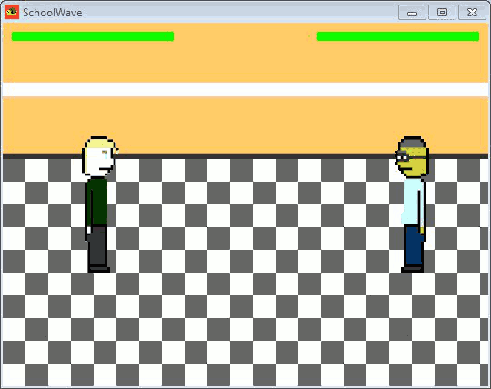

# SchoolWave

Schoolwave is a game set in a school written in Python where you can taste the feelings of a new student in a new school.

**THIS GAME ISN'T ENDED**

***

### Dependency

* pygame

### Install lib (Linux)

`pip install pygame`

### Install lib (Windows)

If you're using 32bit hardware can download the official pygame lib 32bit for python 2.\* at the [official site](https://www.pygame.org/download.shtml). If you're using 64bit hardware can download the unofficial pygame lib 64bit from [this site](https://www.lfd.uci.edu/~gohlke/pythonlibs/#pygame), extract the folder "pygame" and put it in "C:\python2\*\Lib\".

### How to add things

The game is pretty dynamic, then to add things, like a new random t-shirt, just add a png image 150x150px in "texture/body/", it will appear in the game. Or if you want to add dialog just go in "lang/en.xml" for all the strings in english in the game or go in "lang/en-test.xml" for all the strings in english in the test game.

### Screenshots

### Further informations

**This work is based on fiction.** 
Any resemblance to real events and/or to real persons, living or dead, is purely coincidental. We have no intention of discriminating or offending any person, creed or ideology.

***

[CREDITS](CREDITS) 
[LICENSE](LICENSE)